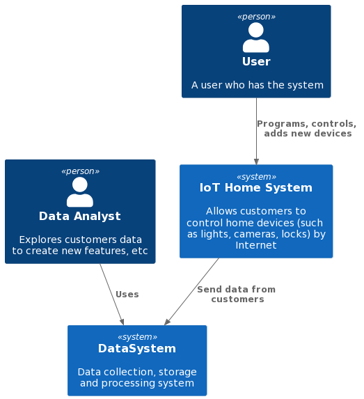

https://nealford.com/katas/kata?id=LightsPlease

# Business Case (Lights, Please)
A home electronics giant wants to build a system for home automation: turning lights on and off, locking and unlocking doors, remote camera observation, and future unspecified behavior.

Users: each system will be sold to consumers (small families), but the company expects to sell thousands of these units in the first three years.

Requirements: 
- the system must be as turnkey as possible, but be sold in modular units (camera, lock, thermostat, etc) for easy purchase
- the units must be accessible over the Internet (for remote monitoring and access), and it is assumed the user will have an existing WiFi setup (router and connection) to tap into
- customers can program the system to control the various modules according to their own needs.
- the electrical engineering for the units will be taken care of by other groups, and the software protocols for controlling the modules is flexible, according to the needs/designs of your architecture. (They will handle implementing the module side of the protocol, once you have specified it to them.)

Additional Context:
- willing to invest a large sum to get this new line of business off the ground
- collects data from customers who opt in to gather broader statistics
- international company

## Business Drivers
- availability of a large sum for investment
- flexibility in electronics development (electronics giant => availability of various electronic technologies)
- ability to develop their own protocols
- access to international market

## Business Goals
Develop of a home automation system. 
The company has access to technologies and electronic engineers. There is large financial resourcing and there are their own products (devices, protocols, etc).

# System Requirements
## Stakeholders
**Key** stekeholders:
+ SH-1. Investors
They invest in the system that will pay off in full and will bring money.
+ SH-2. Product Director
He is a owner of the system. Responsible for the system. Responsible for providing data on what the business needs.
+ SH-3. Users
In general, nothing is expected since this the system is new. However they potentially want access to a flexible and simple home automation system.
+ SH-4. Data Analyst
He wants data from users to be of high quality and arrive quickly.

## Base User Cases (express Functional Requirements)
+ UC-1. Setting up / Programming (by users)
User sets up the system himself. (SH-3)
+ UC-2. Using by Internet (by users)
User uses the system to control devices: turning lights on and off, locking and unlocking doors, remote camera observation. (SH-3)
User uses the Internet to control system. (SH-3)
+ UC-3. Adding a new device (by users)
User adds and sets up a new device in the existing system. (SH-3)
+ UC-4. Adding a new device (by the company)
The company delivers to market a new device which users can get and add to their system. (SH-2)
+ UC-5. Collecting data from users 
The company collects data from users and use it to produce new features/devices. (SH-2, SH-4)

## Nonfunctional Requirements
+ The system should be as turnkey as possible.
+ The system should use company's developments, devices, protocols.
+ Access to the settings menu should not be very long (< 5s).
+ Access to the device should not be very long (< 10s).

## Context Diagram

## Critical scenarios and characteristics
+ The ability of interaction by the Internet.
+ Turnkey "degree".

## ADRs
(Note, In fact, this info is really not within my competence. I can only assume but I can't estimate it.)  
E.g.  
AD-1. Interaction by the Internet.
+ Alternative 1. Use a separate module-station to connect with a router/server and devices don't connect with each other. 
+ Alternative 2. Use a separate module-station to connect with  arouter/server and devices connect with each other. 
+ Alternative 3. Each device directly connect to router/server.
